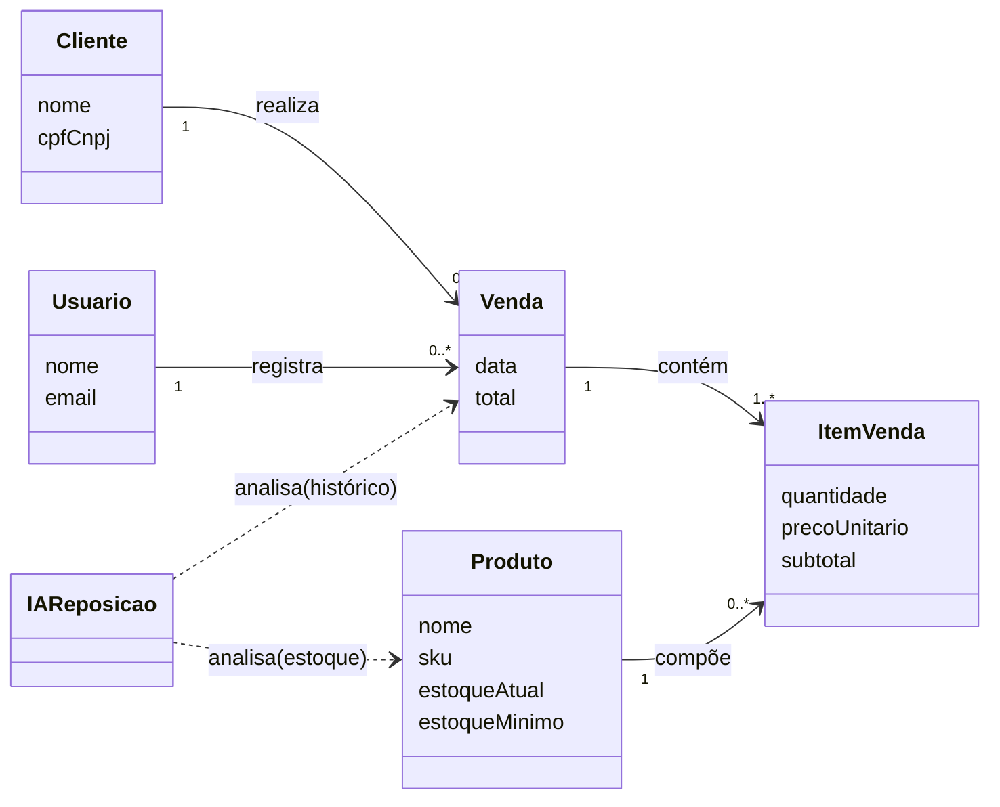

# Diagrama de Domínio

```mermaid
classDiagram
direction LR

class Usuario {
  nome
  email
}

class Cliente {
  nome
  cpfCnpj
}

class Produto {
  nome
  sku
  estoqueAtual
  estoqueMinimo
}

class Venda {
  data
  total
}

class ItemVenda {
  quantidade
  precoUnitario
  subtotal
}

class IAReposicao

Cliente "1" --> "0..*" Venda : realiza
Usuario "1" --> "0..*" Venda : registra
Venda "1" --> "1..*" ItemVenda : contém
Produto "1" --> "0..*" ItemVenda : compõe

IAReposicao ..> Produto : analisa(estoque)
IAReposicao ..> Venda : analisa(histórico)
```
