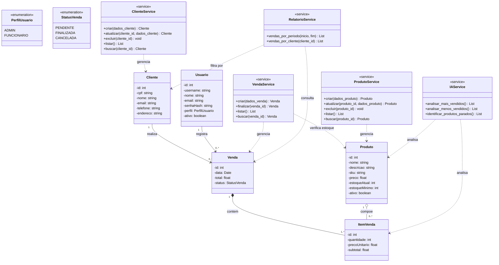

# Diagrama de Classes 

```mermaid
classDiagram
  direction TB

  class PerfilUsuario {
    <<enumeration>>
    ADMIN
    FUNCIONARIO
  }

  class StatusVenda {
    <<enumeration>>
    PENDENTE
    FINALIZADA
    CANCELADA
  }

  class Usuario {
    -id: int
    -username: string
    -nome: string
    -email: string
    -senhaHash: string
    -perfil: PerfilUsuario
    -ativo: boolean
  }

  class Cliente {
    -id: int
    -cpf: string
    -nome: string
    -email: string
    -telefone: string
    -endereco: string
  }

  class Produto {
    -id: int
    -nome: string
    -descricao: string
    -sku: string
    -preco: float
    -estoqueAtual: int
    -estoqueMinimo: int
    -ativo: boolean
  }

  class Venda {
    -id: int
    -data: Date
    -total: float
    -status: StatusVenda
  }

  class ItemVenda {
    -id: int
    -quantidade: int
    -precoUnitario: float
    -subtotal: float
  }

  class VendaService {
    <<service>>
    +criar(dados_venda) Venda
    +finalizar(venda_id) Venda
    +listar() List
    +buscar(venda_id) Venda
  }

  class ClienteService {
    <<service>>
    +criar(dados_cliente) Cliente
    +atualizar(cliente_id, dados_cliente) Cliente
    +excluir(cliente_id) void
    +listar() List
    +buscar(cliente_id) Cliente
  }

  class ProdutoService {
    <<service>>
    +criar(dados_produto) Produto
    +atualizar(produto_id, dados_produto) Produto
    +excluir(produto_id) void
    +listar() List
    +buscar(produto_id) Produto
  }

  class RelatorioService {
    <<service>>
    +vendas_por_periodo(inicio, fim) List
    +vendas_por_cliente(cliente_id) List
  }

  class IAService {
    <<service>>
    +analisar_mais_vendidos() List
    +analisar_menos_vendidos() List
    +identificar_produtos_parados() List
  }

Cliente "1" --> "0..*" Venda : realiza
Usuario "1" --> "0..*" Venda : registra
Venda "1" *-- "1..*" ItemVenda : contem
Produto "1" o-- "0..*" ItemVenda : compoe
VendaService ..> Venda : gerencia
VendaService ..> Produto : verifica estoque
ClienteService ..> Cliente : gerencia
ProdutoService ..> Produto : gerencia
RelatorioService ..> Venda : consulta
RelatorioService ..> Cliente : filtra por
IAService ..> Produto : analisa
IAService ..> ItemVenda : analisa
```
