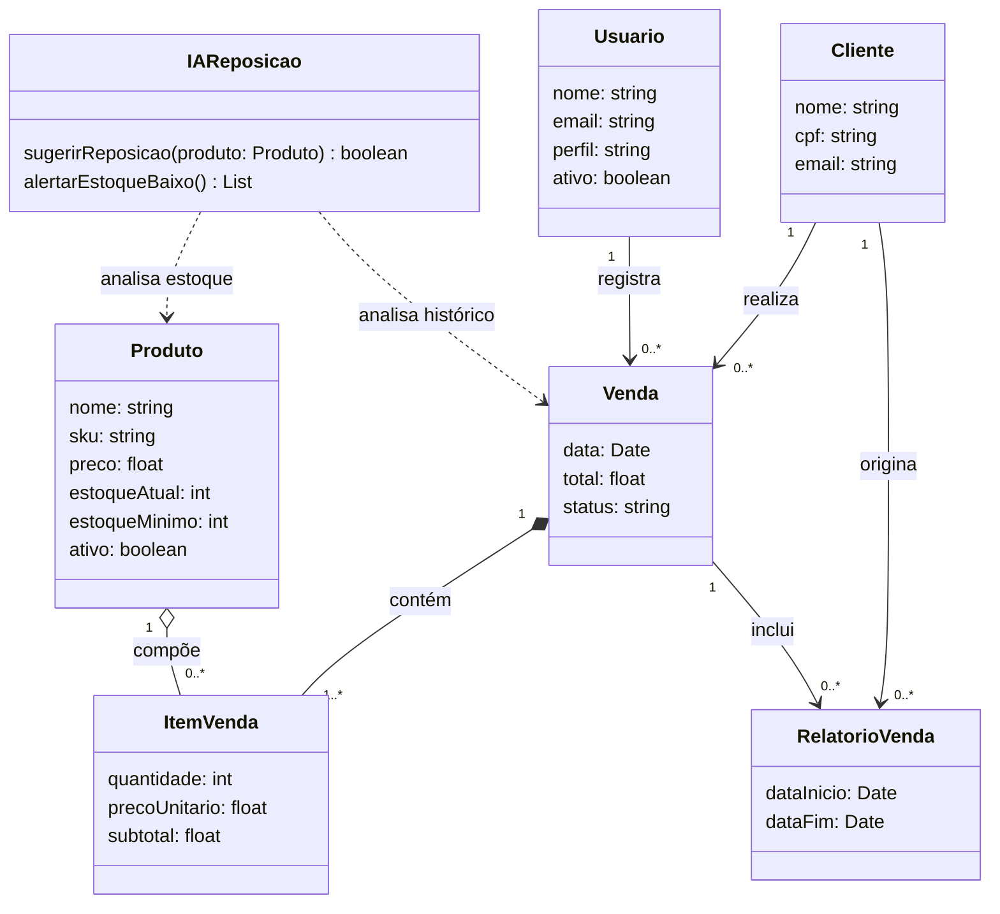

# Diagrama de Domínio — PapelLog

```mermaid
classDiagram
  direction TB

  class Usuario {
    nome: string
    email: string
    perfil: string
    ativo: boolean
  }

  class Cliente {
    nome: string
    cpf: string
    email: string
  }

  class Produto {
    nome: string
    sku: string
    preco: float
    estoqueAtual: int
    estoqueMinimo: int
    ativo: boolean
  }

  class Venda {
    data: Date
    total: float
    status: string
  }

  class ItemVenda {
    quantidade: int
    precoUnitario: float
    subtotal: float
  }

  class RelatorioVenda {
    dataInicio: Date
    dataFim: Date
  }

  class IAReposicao {
    sugerirReposicao(produto: Produto) boolean
    alertarEstoqueBaixo() List
  }

  Cliente "1" --> "0..*" Venda : realiza
  Usuario "1" --> "0..*" Venda : registra
  Venda "1" *-- "1..*" ItemVenda : contém
  Produto "1" o-- "0..*" ItemVenda : compõe
  Cliente "1" --> "0..*" RelatorioVenda : origina
  Venda "1" --> "0..*" RelatorioVenda : inclui
  IAReposicao ..> Produto : analisa estoque
  IAReposicao ..> Venda : analisa histórico
```

