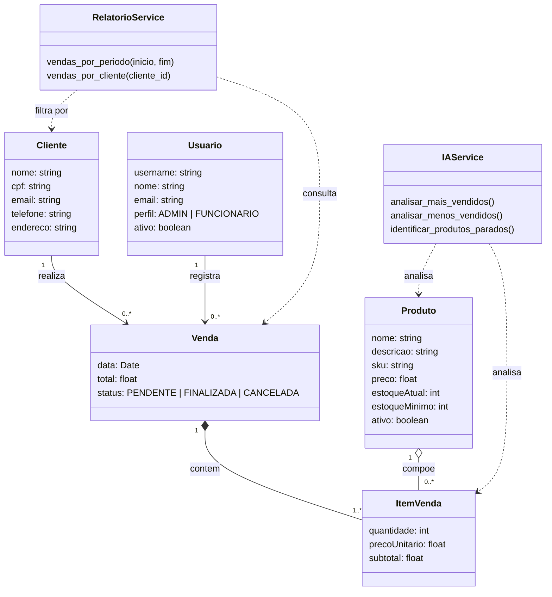

# Diagrama de Domínio 

```mermaid
classDiagram
  direction TB

  class Usuario {
    username: string
    nome: string
    email: string
    perfil: ADMIN | FUNCIONARIO
    ativo: boolean
  }

  class Cliente {
    nome: string
    cpf: string
    email: string
    telefone: string
    endereco: string
  }

  class Produto {
    nome: string
    descricao: string
    sku: string
    preco: float
    estoqueAtual: int
    estoqueMinimo: int
    ativo: boolean
  }

  class Venda {
    data: Date
    total: float
    status: PENDENTE | FINALIZADA | CANCELADA
  }

  class ItemVenda {
    quantidade: int
    precoUnitario: float
    subtotal: float
  }

  class RelatorioService {
    vendas_por_periodo(inicio, fim)
    vendas_por_cliente(cliente_id)
  }

  class IAService {
    analisar_mais_vendidos()
    analisar_menos_vendidos()
    identificar_produtos_parados()
  }

  Cliente "1" --> "0..*" Venda : realiza
  Usuario "1" --> "0..*" Venda : registra
  Venda "1" *-- "1..*" ItemVenda : contem
  Produto "1" o-- "0..*" ItemVenda : compoe
  RelatorioService ..> Venda : consulta
  RelatorioService ..> Cliente : filtra por
  IAService ..> Produto : analisa
  IAService ..> ItemVenda : analisa
```
